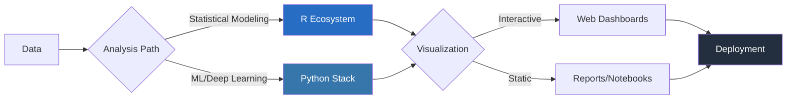
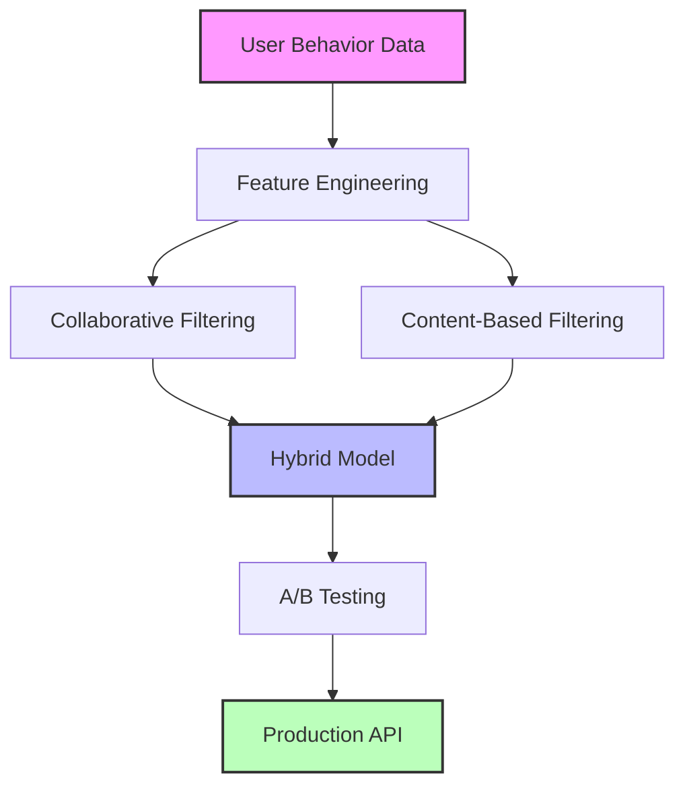
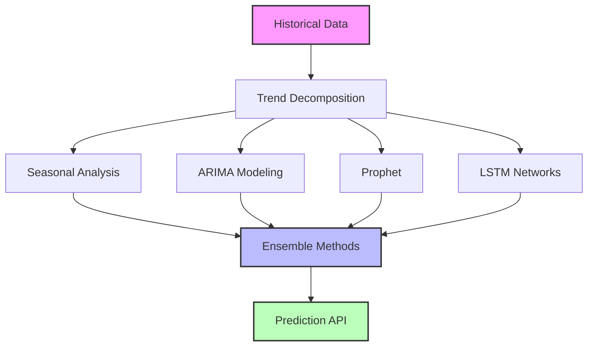

<div align="center">
  
  
  
  # **JOAQUIM TIMÓTEO**
  ### _Bilingual Data Architect: Python × R_
  
  [](https://github.com/joaquimtimoteo)
  [](https://www.linkedin.com/in/joaquim-timóteo-619957227)
  [](https://kaggle.com/joaquimtimoteo)
</div>

---

<table>
<tr>
<td width="60%">

## // ARCHITECTING DATA SOLUTIONS

```python
def expertise():
    return {
        "machine_learning": {
            "deep": ["TensorFlow", "PyTorch"],
            "traditional": ["scikit-learn", "XGBoost"]
        },
        "engineering": {
            "data": ["Pandas", "NumPy", "Spark"],
            "cloud": ["AWS", "GCP", "Azure"]
        },
        "visualization": ["Plotly", "Seaborn", "D3.js"]
    }
```

</td>
<td width="40%">

## // R ANALYTICS FORGE

```r
analytics_mastery <- list(
  statistical = c("Bayesian", "Time Series"),
  interactive = c("Shiny", "htmlwidgets"),
  reports = c("RMarkdown", "Quarto"),
  packages = c("tidyverse", "data.table")
)
```

</td>
</tr>
</table>

---

## ⚡ BILINGUAL DATA SCIENCE PIPELINE ⚡

<div align="center">



</div>

---

<table>
<tr>
<td width="50%">

## 🔬 CODE CRAFTSMANSHIP

```python
# Python ML Pipeline Architect
def build_robust_pipeline(data, target):
    # Define preprocessing steps
    numeric_transformer = Pipeline(steps=[
        ('imputer', SimpleImputer(strategy='median')),
        ('scaler', StandardScaler())
    ])
    
    categorical_transformer = Pipeline(steps=[
        ('imputer', SimpleImputer(strategy='constant')),
        ('encoder', OneHotEncoder(handle_unknown='ignore'))
    ])
    
    # Column transformer for mixed data types
    preprocessor = ColumnTransformer(
        transformers=[
            ('num', numeric_transformer, selector_num),
            ('cat', categorical_transformer, selector_cat)
        ])
    
    # Create production-ready pipeline
    model_pipeline = Pipeline(steps=[
        ('preprocessor', preprocessor),
        ('classifier', RandomForestClassifier(
            n_estimators=100,
            max_depth=None,
            min_samples_split=2,
            random_state=42
        ))
    ])
    
    # Train with cross-validation
    return model_pipeline.fit(data, target)
```

</td>
<td width="50%">

## 📊 STATISTICAL MASTERY

```r
# Advanced Bayesian Analysis in R
advanced_modeling <- function(data) {
  # Bayesian hierarchical model with Stan
  model <- brm(
    formula = outcome ~ predictor1 + predictor2 + 
      (1 + predictor1 | group),
    data = data,
    family = gaussian(),
    prior = c(
      prior(normal(0, 10), class = "b"),
      prior(cauchy(0, 2), class = "sd")
    ),
    chains = 4,
    iter = 2000,
    warmup = 1000,
    cores = 4
  )
  
  # Generate posterior predictions
  predictions <- posterior_predict(
    model, 
    newdata = prediction_data
  )
  
  # Return model and diagnostics
  return(list(
    model = model,
    diagnostics = pp_check(model),
    predictions = predictions
  ))
}
```

</td>
</tr>
</table>

---

## 🔮 EMERGING TECHNOLOGY FOCUS

<div align="center">
<table>
<tr>
<td align="center"><b>ML Ops</b></td>
<td align="center"><b>MLflow</b></td>
<td align="center"><b>Kubeflow</b></td>
<td align="center"><b>Docker</b></td>
<td align="center"><b>CI/CD</b></td>
</tr>
<tr>
<td align="center"><b>Distributed Computing</b></td>
<td align="center"><b>Dask</b></td>
<td align="center"><b>Spark</b></td>
<td align="center"><b>Ray</b></td>
<td align="center"><b>Kubernetes</b></td>
</tr>
<tr>
<td align="center"><b>Deep Learning</b></td>
<td align="center"><b>PyTorch</b></td>
<td align="center"><b>TensorFlow</b></td>
<td align="center"><b>JAX</b></td>
<td align="center"><b>ONNX</b></td>
</tr>
<tr>
<td align="center"><b>Data Engineering</b></td>
<td align="center"><b>Airflow</b></td>
<td align="center"><b>DBT</b></td>
<td align="center"><b>Snowflake</b></td>
<td align="center"><b>BigQuery</b></td>
</tr>
</table>
</div>

---

## 📈 PROJECT ARCHITECTURE SHOWCASE

<table>
<tr>
<td width="50%">

### 🧠 Recommendation Engine



</td>
<td width="50%">

### 📊 Time Series Forecasting



</td>
</tr>
</table>

---

<div align="center">

## ✨ CONTRIBUTIONS WELCOME ✨

</div>

```python
def collaborate():
    domains = ["MLOps", "Generative AI", "Causal Inference", "Bayesian Modeling"]
    interests = ["Open Source", "Mentorship", "Research", "Teaching"]
    
    return "Always open to collaborating on innovative data science projects!"
```

<div align="center">
  
  ---
  
  ### 📫 Reach out for collaborations, consulting, or just to chat about data science

</div>
