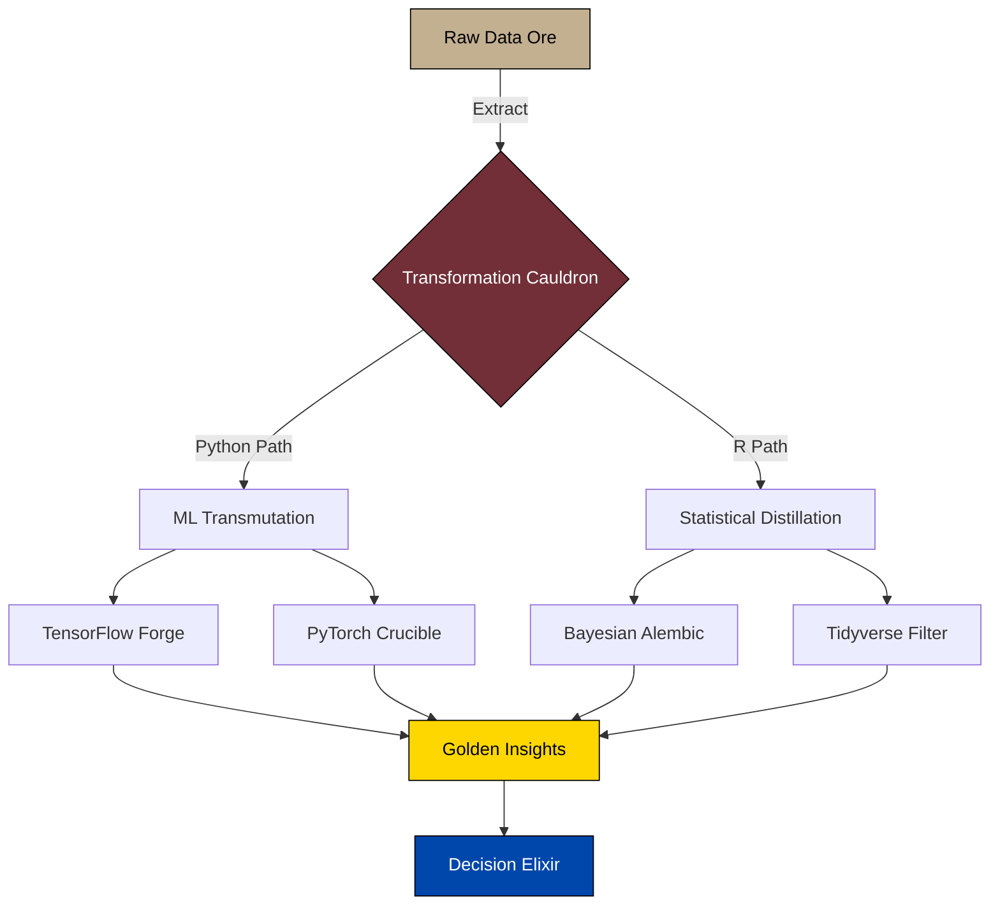

<div align="center">
  <pre style="line-height: 1.1;">
▄▄▄   ▄▄▄     ▄▄▄▄      ▄▄▄     ██     ▄█▄ ▄█ ██    ▄▄
█   █ █   █   █    █    █   █   █  █   █▀ ▀  █  █    █▀▀
█   █ █   █   █    █    █▀▀▀▀   █▄▄█  ██▀    █  █▄▄  ██▄
▀▀▀▀  ▀▀▀▀▀   ▀▀▀▀▀     ▀       ▀▀▀   ▀      ▀  ▀▀▀  ▀▀▀
                 ▀█▀ █ █▀▄▀█ ▄▀▄ ▀█▀ █▀▀ ▄▀▄
                  █  █ █ ▀ █ █▀█  █  █▀  █▀█
  </pre>

  <div style="margin: 20px 0;">
    
    <b> + </b>
    
    <b> = </b>
    <span style="font-size: 2rem;">🔮</span>
  </div>
  
  [](https://github.com/joaquimtimoteo)
  [](https://www.linkedin.com/in/joaquim-timóteo-619957227)
  [](https://kaggle.com/joaquimtimoteo)
</div>

---

<div align="center">
  <h2>🔄 DUAL-WIELDING DATA SCIENCE 🔄</h2>
  <i>Because why master one language when you can master two?</i>
</div>

```
╔═══════════════╗  ╔════════════════╗
║ PYTHON DOMAIN ║  ║    R DOMAIN    ║
╚═══════════════╝  ╚════════════════╝
      ┃                   ┃
      ▼                   ▼
┏━━━━━━━━━━━━━━━━┓  ┏━━━━━━━━━━━━━━━━┓
┃ • TensorFlow   ┃  ┃ • Tidyverse    ┃
┃ • PyTorch      ┃  ┃ • Shiny        ┃
┃ • Scikit-learn ┃  ┃ • Stan/brms    ┃
┃ • Dask/Spark   ┃  ┃ • data.table   ┃
┗━━━━━━━━━━━━━━━━┛  ┗━━━━━━━━━━━━━━━━┛
      ┃                   ┃
      ▼                   ▼
  ┏━━━━━━━━━━━━━━━━━━━━━━━━━━┓
  ┃     DATA SOLUTIONS       ┃
  ┗━━━━━━━━━━━━━━━━━━━━━━━━━━┛
```

---

<div align="center">
  <h1>⚡ THE LANGUAGE TRANSFORMER ⚡</h1>
</div>

<table align="center">
  <tr>
    <td valign="top" style="padding: 0 20px;">
      <h3>Python Incantations</h3>
      <pre style="background: #f6f8fa; padding: 1rem; border-radius: 6px;">
def summon_ml_powers():
    spells = {
        "classification": [
            "🌲 RandomForest",
            "🔥 XGBoost",
            "🧠 Neural Networks"
        ],
        "regression": [
            "📉 LinearRegression",
            "💫 ElasticNet",
            "🌊 GradientBoosting"
        ]
    }
    
    return "✨ Machine Learning Wizard ✨"
      </pre>
    </td>
    <td valign="top" style="padding: 0 20px;">
      <h3>R Enchantments</h3>
      <pre style="background: #f6f8fa; padding: 1rem; border-radius: 6px;">
cast_statistical_magic <- function() {
  spells <- list(
    modeling = c("📊 ggplot2", "🧮 lme4", "🔮 Stan"),
    analysis = c("📈 time series", "🌐 spatial", "🧩 structural")
  )
  
  return("✨ Statistical Sorcerer ✨")
}
      </pre>
    </td>
  </tr>
</table>

---

<div align="center">
  <h2>💠 DATA ALCHEMY LAB 💠</h2>
</div>



---

<div align="center">
  <h2>🧪 CODE POTIONS 🧪</h2>
</div>

<table align="center">
  <tr>
    <td valign="top" style="padding: 0 20px;">
      <div align="center"><b>⚗️ PYTHON BREW ⚗️</b></div>
      <pre style="background: #f6f8fa; padding: 1rem; border-radius: 6px;">
from sklearn.pipeline import Pipeline
from sklearn.ensemble import RandomForestClassifier
from sklearn.preprocessing import StandardScaler

def craft_ml_potion(ingredients):
    """Transforms raw data into prediction gold."""
    potion = Pipeline([
        ('purify', StandardScaler()),
        ('enchant', RandomForestClassifier(
            n_estimators=100,
            max_features='sqrt',
            bootstrap=True,
            oob_score=True
        ))
    ])
    potion.fit(ingredients['X'], ingredients['y'])
    return "✨ The potion is ready! ✨"
      </pre>
    </td>
    <td valign="top" style="padding: 0 20px;">
      <div align="center"><b>⚗️ R ELIXIR ⚗️</b></div>
      <pre style="background: #f6f8fa; padding: 1rem; border-radius: 6px;">
library(tidyverse)
library(brms)

craft_statistical_elixir <- function(ingredients) {
  formula <- bf(
    outcome ~ s(predictor1) + (1 + predictor2 | group)
  )
  elixir <- brm(
    formula = formula,
    data = ingredients,
    family = gaussian(),
    prior = c(
      prior(normal(0, 5), class = "b"),
      prior(normal(0, 3), class = "sd")
    ),
    chains = 4,
    cores = 4
  )
  return("✨ The elixir is ready! ✨")
}
      </pre>
    </td>
  </tr>
</table>

---

<div align="center">
  <h2>📚 SPELLBOOKS 📚</h2>
</div>

<table align="center" style="width: 100%; text-align: center;">
  <tr>
    <td width="33%">
      <h3>🐍 Python Grimoire</h3>
      <ul style="text-align: left; display: inline-block;">
        <li>Deep Learning Incantations</li>
        <li>NLP Enchantments</li>
        <li>Computer Vision Spells</li>
        <li>MLOps Rituals</li>
      </ul>
    </td>
    <td width="33%">
      <h3>📊 R Tome</h3>
      <ul style="text-align: left; display: inline-block;">
        <li>Bayesian Prophecies</li>
        <li>Statistical Divinations</li>
        <li>Time Series Scrying</li>
        <li>Visualization Conjuring</li>
      </ul>
    </td>
    <td width="33%">
      <h3>⚙️ Engineering Scrolls</h3>
      <ul style="text-align: left; display: inline-block;">
        <li>Cloud Architecture Runes</li>
        <li>API Integration Sigils</li>
        <li>Database Wards</li>
        <li>CI/CD Talismans</li>
      </ul>
    </td>
  </tr>
</table>

---

<div align="center">
  <h2>🔮 THE PROPHECY 🔮</h2>
  <pre style="font-style: italic; margin: 0 auto; max-width: 600px;">
In the realm of DATA, a bilingual practitioner emerges,
Where PYTHON and R harmonize into powerful convergence.
Seeking collaborations with fellow wizards and witches,
To transform raw data into DECISION riches.
  </pre>
  <br>
  <h3>🧙‍♂️ JOIN MY QUEST 🧙‍♀️</h3>
  [](https://github.com/joaquimtimoteo)
</div>

---

<div align="center">
  <pre style="line-height: 1.1;">
           ___                             ___           
          /\__\          ___              /\  \          
         /::|  |        /\  \            /::\  \         
        /:|:|  |        \:\  \          /:/\:\  \        
       /:/|:|__|__      /::\__\        /::\~\:\  \       
      /:/ |::::\__\  __/:/\/__/       /:/\:\ \:\__\      
      \/__/~~/:/  / /\/:/  /          \/__\:\ \/__/      
            /:/  /  \::/__/                \:\__\        
           /:/  /    \:\__\                 \/__/        
          /:/  /      \/__/                              
          \/__/                                          
  </pre>
</div>

