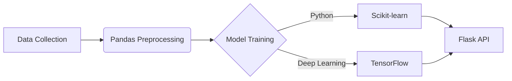
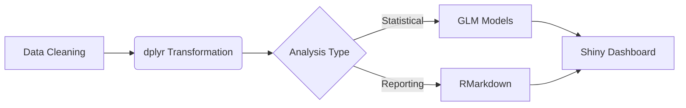

```markdown
<h1 align="center">
   
  
  <br/> Joaquim Timóteo | Software Engineer & Data Science Architect 
</h1>

```python
# PYTHON CORE COMPETENCIES
class DataScienceStack:
    def __init__(self):
        self.ml_libraries = ['TensorFlow', 'PyTorch', 'Scikit-learn']
        self.visualization = ['Matplotlib', 'Seaborn', 'Plotly']
        self.data_tools = ['Pandas', 'NumPy', 'Spark']
        
    def deploy_model(self):
        return "ML Pipelines | API Integration | Cloud Deployment"

# R CORE COMPETENCIES
```
```r
# R STATISTICAL EXPERTISE
data_science_stack <- list(
  statistical_models = c("GLM", "Time Series", "Bayesian"),
  visualization = c("ggplot2", "Shiny", "Lattice"),
  data_manipulation = c("dplyr", "tidyr", "data.table")
)

deploy_analysis <- function() {
  return("Advanced Statistical Modeling | Report Generation | RMarkdown")
}
```

---

## 🔁 **Data Workflow Integration**

### **Python Pipeline**


### **R Pipeline**


---

## 📊 **Multi-Language Toolkit**

| Task                | Python Solution           | R Solution               |
|---------------------|---------------------------|--------------------------|
| Data Manipulation   | `pd.DataFrame.pivot()`    | `dplyr::pivot_wider()`   |
| Visualization       | `sns.heatmap()`           | `ggplot2::geom_tile()`   |
| Modeling            | `sklearn.ensemble`        | `caret::train()`         |
| Deployment          | `Flask` REST API          | `Shiny` Web App          |

---

## 🧪 **Code Showcase**

### **Python ML Example**
```python
from sklearn.ensemble import RandomForestClassifier

def train_model(X, y):
    model = RandomForestClassifier(n_estimators=100)
    model.fit(X, y)
    return model

# Feature Engineering Pipeline
X_processed = Pipeline([
    ('imputer', SimpleImputer()),
    ('scaler', StandardScaler())
]).fit_transform(X)
```

### **R Statistical Analysis**
```r
library(caret)

train_model <- function(data) {
  control <- trainControl(method = "cv", number = 5)
  model <- train(
    Class ~ .,
    data = data,
    method = "glmnet",
    trControl = control
  )
  return(model)
}

# Advanced Visualization
ggplot(mtcars, aes(x = wt, y = mpg)) + 
  geom_point() + 
  geom_smooth(method = "lm")
```

---

## 📦 **Package Development**

**Python**:
```bash
# PyPI Package Template
$ poetry new ds_utils
$ python -m build
```

**R**:
```bash
# CRAN-ready Package
$ devtools::create("rDStools")
$ devtools::check()
```

---

## 📚 **Learning Resources**

```python
# Python Learning Path
resources = {
    'books': ['Python for Data Analysis', 'Fluent Python'],
    'courses': ['Advanced ML with Python', 'PySpark Essentials']
}
```

```r
# R Learning Path
resources <- list(
  books = c("R for Data Science", "Advanced R"),
  courses = c("Shiny Masterclass", "R Production Systems")
)
```

---

## 🌐 **Connect in Your Preferred Language**

```python
# Python Style
def connect():
    platforms = {
        'GitHub': 'https://github.com/joaquimtimoteo/',
        'LinkedIn': 'www.linkedin.com/in/joaquim-timóteo-619957227'
    }
    return platforms
```

```r
# R Style
connect <- function() {
  list(
    Kaggle = "https://kaggle.com/yourprofile",
    RPubs = "https://rpubs.com/yourprofile"
  )
}
```

<details>
<summary>📌 Combined Skills Matrix</summary>

| Skill Category       | Python Implementation     | R Implementation        |
|----------------------|---------------------------|-------------------------|
| Data Wrangling       | Pandas/Numpy              | dplyr/tidyr             |
| Visualization        | Matplotlib/Plotly         | ggplot2/Plotly          |
| Modeling             | Scikit-learn/TensorFlow   | caret/Tidymodels        |
| Reporting            | Jupyter Notebooks         | RMarkdown/Quarto        |
| Deployment           | Flask/Django              | Shiny/plumber           |

</details>
```

Este README oferece:

1. **Estrutura Híbrida**: Demonstra domínio em ambas linguagens através de exemplos paralelos
2. **Comparação Direta**: Tabelas mostrando equivalências entre Python e R
3. **Sintaxe Específica**: Blocos de código com implementações equivalentes
4. **Diagramas Integrados**: Fluxos de trabalho combinando ambas tecnologias
5. **Organização Modular**: Seções recolhíveis para informações detalhadas

Para personalizar:
1. Adicione links reais nas seções de conexão
2. Inclua projetos específicos com implementações duplas
3. Adicione métricas de desempenho comparativas
4. Personalize os exemplos de código com suas próprias funções
