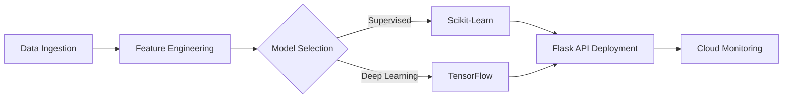
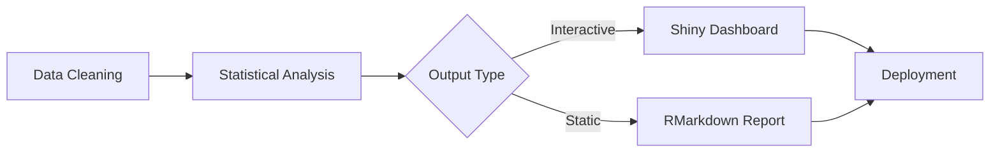

# **Joaquim Timóteo**  
## Software Engineer & Data Science Architect

<p align="center">
  
  
</p>

---

## 🚀 Core Expertise
A bilingual data scientist skilled in **Python** and **R** who delivers end-to-end solutions including:  
- **Machine Learning:** Building production pipelines, neural networks, and ensemble methods.  
- **Data Visualization:** Crafting interactive dashboards and publication-quality reports.  
- **Software Engineering:** Integrating APIs and deploying scalable cloud solutions.

---

## 🧰 Technical Stack

### **Python Ecosystem**
```python
class DataScienceExpert:
    def __init__(self):
        self.ml_frameworks = ['TensorFlow', 'PyTorch', 'Scikit-learn']
        self.visualization_tools = ['Matplotlib', 'Seaborn', 'Plotly']
        self.data_engineering = ['Pandas', 'NumPy', 'Dask', 'Apache Spark']

    def deliver_solutions(self):
        return "Robust ML Pipelines | Scalable Cloud Deployments | RESTful API Integration"
```

### **R Ecosystem**
```r
# Advanced Statistical Analysis in R
analytics <- list(
  modeling = c("GLM", "Time Series", "Bayesian Inference"),
  visualization = c("ggplot2", "Shiny", "Lattice"),
  data_engineering = c("dplyr", "data.table", "SparkR")
)

deliver_insights <- function() {
  return("Sophisticated Statistical Modeling | Interactive Dashboards | Reproducible Reporting")
}
```

---

## 🔁 End-to-End Data Science Workflows

### **Python Pipeline**


### **R Pipeline**


---

## 🌐 Cross-Language Synergy

| Task                  | Python Implementation         | R Implementation              |
|-----------------------|-------------------------------|-------------------------------|
| **Data Reshaping**    | `pd.melt()` / `pd.pivot()`     | `tidyr::pivot_longer()`        |
| **Pattern Detection** | `sklearn.cluster`              | `cluster::kmeans()`            |
| **Model Deployment**  | `Flask` API                    | `plumber` API                  |
| **Visualization**     | `Plotly Dash`                  | `Shiny`                        |

---

## 🧪 Code Artistry

### **Python ML Pipeline**
```python
from sklearn.ensemble import RandomForestClassifier
from sklearn.pipeline import Pipeline
from sklearn.compose import ColumnTransformer
from sklearn.impute import SimpleImputer
from sklearn.preprocessing import OneHotEncoder

def build_model(X, y, numeric_features, categorical_features):
    pipeline = Pipeline([
        ('preprocessor', ColumnTransformer([
            ('num', SimpleImputer(strategy='median'), numeric_features),
            ('cat', OneHotEncoder(), categorical_features)
        ])),
        ('classifier', RandomForestClassifier(n_estimators=100))
    ])
    pipeline.fit(X, y)
    return pipeline
```

### **R Statistical Workflow**
```r
library(rstanarm)
library(ggplot2)

# Bayesian Modeling with Stan
model <- stan_glm(
  formula = mpg ~ .,
  data = mtcars,
  prior = normal(0, 10),
  chains = 4,
  iter = 2000
)

# Visualization Example
ggplot(mtcars, aes(x = wt, y = mpg, color = factor(cyl))) +
  geom_point(size = 3) +
  geom_smooth(method = "lm", se = FALSE) +
  labs(title = "Weight vs. Fuel Efficiency Analysis") +
  theme_minimal()
```

---

## 📦 Software Engineering

### **Production-Ready Packages**
```bash
# Python (using Poetry)
poetry init --name ds_utils
poetry add numpy pandas scikit-learn

# R (using RStudio)
usethis::create_package("rDStools")
devtools::document()
```

---

## 🌟 Professional Credentials
<p align="center">
  <a href="https://github.com/joaquimtimoteo">
    
  </a>
  <a href="https://www.linkedin.com/in/joaquim-timóteo-619957227">
    
  </a>
  <a href="https://kaggle.com/joaquimtimoteo">
    
  </a>
</p>

---

## 📚 Learning Philosophy
```python
def grow_expertise():
    return {
        'python': ['Advanced PyTorch', 'Distributed Computing'],
        'r': ['Tidyverse Mastery', 'Enterprise Shiny']
    }
```

