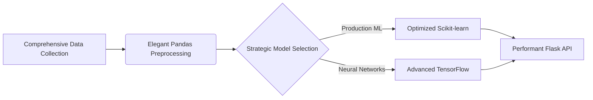
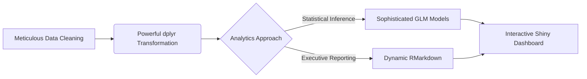

<h1 align="center">
   
  
  <br/> Joaquim Timóteo | Software Engineer & Data Science Architect 
</h1>

```python
class DataScienceExpertise:
    def __init__(self):
        self.ml_frameworks = ['TensorFlow', 'PyTorch', 'Scikit-learn']
        self.visualization_tools = ['Matplotlib', 'Seaborn', 'Plotly']
        self.analytics_stack = ['Pandas', 'NumPy', 'Spark']
        
    def deliver_solutions(self):
        return "Robust ML Pipelines | Seamless API Integration | Scalable Cloud Deployment"
```
```r
# R STATISTICAL PROWESS
advanced_analytics <- list(
  statistical_expertise = c("GLM", "Time Series", "Bayesian Inference"),
  data_visualization = c("ggplot2", "Interactive Shiny", "Lattice"),
  efficient_manipulation = c("dplyr", "tidyr", "data.table")
)

deliver_insights <- function() {
  return("Sophisticated Statistical Modeling | Elegant Report Generation | Interactive RMarkdown")
}
```

---

## 🔁 **End-to-End Data Science Architecture**

### **Python Ecosystem**


### **R Ecosystem**


---

## 📊 **Bilingual Data Science Arsenal**

| Business Need          | Python Implementation           | R Implementation                 |
|------------------------|--------------------------------|----------------------------------|
| Data Restructuring     | `pd.DataFrame.pivot()`         | `dplyr::pivot_wider()`           |
| Pattern Visualization  | `sns.heatmap()`                | `ggplot2::geom_tile()`           |
| Predictive Modeling    | `sklearn.ensemble`             | `caret::train()`                 |
| Solution Delivery      | `Flask` Enterprise REST API    | `Shiny` Executive Dashboards     |

---

## 🧪 **Technical Excellence**

### **Python ML Craftsmanship**
```python
from sklearn.ensemble import RandomForestClassifier

def build_predictive_model(X, y):
    model = RandomForestClassifier(n_estimators=100)
    model.fit(X, y)
    return model

# Robust Feature Engineering Pipeline
X_optimized = Pipeline([
    ('imputer', SimpleImputer(strategy='median')),
    ('scaler', StandardScaler())
]).fit_transform(X)
```

### **R Statistical Mastery**
```r
library(caret)

build_predictive_model <- function(data) {
  control <- trainControl(method = "cv", number = 5)
  model <- train(
    Class ~ .,
    data = data,
    method = "glmnet",
    trControl = control
  )
  return(model)
}

# Sophisticated Visualization
ggplot(mtcars, aes(x = wt, y = mpg)) + 
  geom_point(aes(color = factor(cyl)), size = 3) + 
  geom_smooth(method = "lm") +
  theme_minimal() +
  labs(title = "Weight vs. Efficiency Analysis")
```

---

## 📦 **Software Development Expertise**

**Python**:
```bash
# Production-Ready PyPI Package
$ poetry new ds_utils
$ python -m build
```

**R**:
```bash
# Publication-Quality CRAN Package
$ devtools::create("rDStools")
$ devtools::check()
```

---

## 📚 **Continuous Learning Philosophy**

```python
# Python Excellence Roadmap
knowledge_portfolio = {
    'essential_reading': ['Python for Data Analysis', 'Fluent Python'],
    'professional_development': ['Advanced ML Architecture', 'Distributed PySpark Systems']
}
```

```r
# R Expertise Trajectory
knowledge_portfolio <- list(
  essential_reading = c("R for Data Science", "Advanced R"),
  professional_development = c("Enterprise Shiny Applications", "Production R Systems")
)
```

---

## 🌐 **Professional Network**

```python
# Python Ecosystem
def connect_professionally():
    platforms = {
        'GitHub': 'https://github.com/joaquimtimoteo/',
        'LinkedIn': 'www.linkedin.com/in/joaquim-timóteo-619957227'
    }
    return platforms
```

```r
# R Community
connect_professionally <- function() {
  list(
    Kaggle = "https://kaggle.com/joaquimtimoteo",
    RPubs = "https://rpubs.com/joaquimtimoteo"
  )
}
```

<details>
<summary>📌 Comprehensive Technical Proficiency</summary>

| Domain                | Python Implementation        | R Implementation           |
|-----------------------|------------------------------|----------------------------|
| Data Transformation   | Pandas/Numpy                 | dplyr/tidyr                |
| Data Storytelling     | Matplotlib/Plotly            | ggplot2/Plotly             |
| Predictive Analytics  | Scikit-learn/TensorFlow      | caret/Tidymodels           |
| Insight Communication | Jupyter Notebooks            | RMarkdown/Quarto           |
| Solution Deployment   | Flask/Django                 | Shiny/plumber              |

</details>
