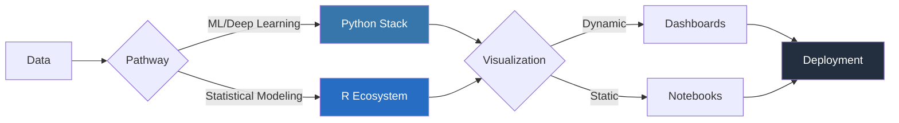
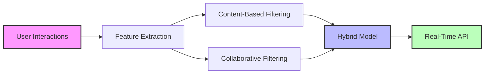
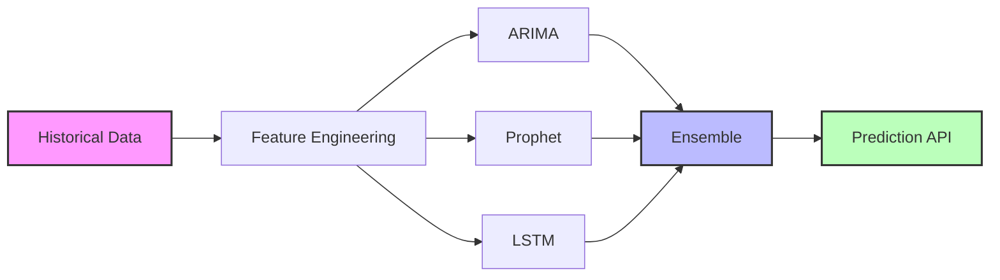

# **🌌 JOAQUIM TIMÓTEO**  
## _Bilingual Data Architect: Python × R_  
<p align="center">
  <a href="https://github.com/joaquimtimoteo">
    
  </a>
  <a href="https://github.com/joaquimtimoteo">
    
  </a>
</p>

---

## 🌐 **Professional Links**  
<p align="center">
  <a href="https://github.com/joaquimtimoteo">
    
  </a>
  <a href="https://www.linkedin.com/in/joaquim-timóteo-619957227">
    
  </a>
  <a href="https://kaggle.com/joaquimtimoteo">
    
  </a>
</p>

---

## 🔮 **Core Expertise**  
<table>
  <tr>
    <td width="50%">
      <details>
        <summary>Python Powerhouse</summary>
        <div align="center">
          
          <br/>
          <strong>Machine Learning</strong>
          <br/>
          <code>TensorFlow</code> | <code>PyTorch</code> | <code>scikit-learn</code>
          <br/>
          <strong>Data Engineering</strong>
          <br/>
          <code>Pandas</code> | <code>Spark</code> | <code>Airflow</code>
          <br/>
          <strong>Deployment</strong>
          <br/>
          <code>Flask</code> | <code>MLflow</code> | <code>Docker</code>
        </div>
      </details>
    </td>
    <td width="50%">
      <details>
        <summary>R Renaissance</summary>
        <div align="center">
          
          <br/>
          <strong>Statistical Analysis</strong>
          <br/>
          <code>Bayesian</code> | <code>Time Series</code> | <code>tidyverse</code>
          <br/>
          <strong>Visualization</strong>
          <br/>
          <code>ggplot2</code> | <code>Shiny</code> | <code>htmlwidgets</code>
          <br/>
          <strong>Production</strong>
          <br/>
          <code>plumber</code> | <code>R Markdown</code> | <code>Shiny Apps</code>
        </div>
      </details>
    </td>
  </tr>
</table>

---

## 🚀 **BILINGUAL DATA PIPELINE**  
<div align="center">

</div>

---

## ⚙️ **CODE ARTISANRY**  
<table>
  <tr>
    <td width="50%">
      <details>
        <summary>Python Pipeline Mastery</summary>
        <div align="left">
```python
# Production-Ready ML Pipeline
from sklearn.pipeline import Pipeline
from sklearn.impute import SimpleImputer
from sklearn.preprocessing import StandardScaler
from sklearn.ensemble import RandomForestClassifier

def build_pipeline():
    return Pipeline([
        ('preprocessor', ColumnTransformer([
            ('num', Pipeline([
                ('imputer', SimpleImputer(strategy='median')),
                ('scaler', StandardScaler())
            ]), numeric_features),
            ('cat', Pipeline([
                ('imputer', SimpleImputer(strategy='most_frequent')),
                ('encoder', OneHotEncoder(handle_unknown='ignore'))
            ]), categorical_features)
        ])),
        ('model', RandomForestClassifier(n_estimators=100, n_jobs=-1))
    ])
```
        </div>
      </details>
    </td>
    <td width="50%">
      <details>
        <summary>R Statistical Workflow</summary>
        <div align="left">
```r
# Bayesian Modeling with brms
library(brms)

model <- brm(
  formula = score ~ 1 + (1 | student) + (1 | school),
  data = education_data,
  family = gaussian(),
  prior = c(
    prior(normal(0, 10), class = Intercept),
    prior(student_t(3, 0, 2.5), class = sigma)
  ),
  chains = 4,
  cores = 4
)
```
        </div>
      </details>
    </td>
  </tr>
</table>

---

## 🌐 **Emerging Tech Stack**  
<div align="center">
<table border="0" cellpadding="10">
  <tr>
    <th colspan="5" style="background:#232F3E;color:white;padding:15px;">ML Engineering</th>
  </tr>
  <tr>
    <td> ML Ops</td>
    <td> MLflow</td>
    <td> Kubeflow</td>
    <td> Docker</td>
    <td> CI/CD</td>
  </tr>
  <tr>
    <th colspan="5" style="background:#276DC3;color:white;padding:15px;">Deep Learning</th>
  </tr>
  <tr>
    <td> PyTorch</td>
    <td> TensorFlow</td>
    <td> JAX</td>
    <td> ONNX</td>
    <td> GPU Optimization</td>
  </tr>
</table>
</div>

---

## 🎯 **Project Showcase**  
<table>
  <tr>
    <td width="50%">
      <details>
        <summary>Hybrid Recommender System</summary>
        <div align="center">

        </div>
      </details>
    </td>
    <td width="50%">
      <details>
        <summary>Time Series Forecasting</summary>
        <div align="center">

        </div>
      </details>
    </td>
  </tr>
</table>

---

## 📫 **Collaboration & Contributions**  
<p align="center">
  
  <br/>
  Open to collaborations in:
  <br/>
  <code>Generative AI</code> | <code>Causal Inference</code> | <code>Production ML</code>
  <br/>
  <code>Bayesian Modeling</code> | <code>Open Source Projects</code>
</p>

```python
def connect():
    return {
        "github": "https://github.com/joaquimtimoteo",
        "linkedin": "https://www.linkedin.com/in/joaquim-timóteo-619957227",
        "kaggle": "https://kaggle.com/joaquimtimoteo"
    }
```
