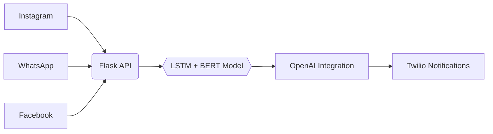

```markdown
<h1 align="center">
  
  <br/>Joaquim Carlos Timóteo 
</h1>

<p align="center">
  
  
  
</p>

<div align="center">
  
📍 **Moscow, Russia** | 📞 **+7 969 100-38-58** | 📧 **joaquimcarlostimoteo1@gmail.com**
  
</div>

---

## 🌟 **Perfil Profissional**


```python
class DataScientist:
    def __init__(self):
        self.skills = {
            'languages': ['🐍 Python', '📈 R', '☕ Java', '🗃️ SQL'],
            'ml_stack': ['🧠 TensorFlow', '🔥 PyTorch', '📊 Scikit-learn'],
            'cloud': ['☁️ AWS', '📦 Docker', '🌀 Kubernetes']
        }
        
    def innovate(self):
        return "Building AI solutions that transform data into impact!"
```

**Data Scientist Sênior** com 5+ anos impulsionando resultados através de:
- 🤖 Automações inteligentes com **85%+ de eficiência**
- 📈 Modelos preditivos com **80-95% de acurácia**
- 💰 **R$50M+** em economias geradas para clientes

---

## 🚀 **Principais Conquistas**

| Área               | Projeto                  | Tecnologias                          | Impacto                  |
|--------------------|--------------------------|--------------------------------------|--------------------------|
|  | Reborn Bet Predictions   | LSTM • XGBoost • Prophet             | 🎯 80% Acerto            |
|  | XBoT Automation          | OpenAI • Flask • BERT                | 👥 3K+ Usuários          |
|  | Financial Risk Models    | Monte Carlo • Pandas • Power BI      | 💵 R$50M Economizados    |

---

## 🛠️ **Stack Técnico**

### **Linguagens & Ferramentas**
<p>
  
  
  
  
</p>

### **Visualização de Dados**


---

## 📈 **Projetos Destacados**

### **XBoT - Automação Multiplataforma**


---

## 📚 **Educação & Certificações**
-  **MSc Data Science**  
  *MTUCI* | 2023-2025  
-  **Udemy Instructor**  
  🏅 4.8/5 Rating | 1K+ Students

---

## 🌐 **Conecte-se Comigo**
<p align="center">
  <a href="[LINK_GITHUB]">
    
  </a>
  <a href="[LINK_LINKEDIN]">
    
  </a>
  <a href="[LINK_UDEMY]">
    
  </a>
</p>
```
