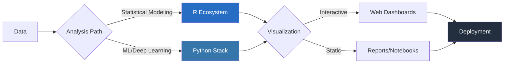

<div align="center">
  
  

  <h1>JOAQUIM TIMÓTEO</h1>
  <h3><em>Bilingual Data Architect: Python × R</em></h3>
  
  [](https://github.com/joaquimtimoteo)
  [](https://www.linkedin.com/in/joaquim-timóteo-619957227)
  [](https://kaggle.com/joaquimtimoteo)
</div>

---

## // ARCHITECTING DATA SOLUTIONS

<div style="display: flex; justify-content: space-between;">
  <div style="width: 60%;">
  
  ### Python Expertise
  ```python
  def expertise():
      return {
          "machine_learning": {
              "deep": ["TensorFlow", "PyTorch"],
              "traditional": ["scikit-learn", "XGBoost"]
          },
          "engineering": {
              "data": ["Pandas", "NumPy", "Spark"],
              "cloud": ["AWS", "GCP", "Azure"]
          },
          "visualization": ["Plotly", "Seaborn", "D3.js"]
      }
  ```
  
  </div>
  
  <div style="width: 35%;">
  
  ### R Analytics Forge
  ```r
  analytics_mastery <- list(
    statistical = c("Bayesian", "Time Series"),
    interactive = c("Shiny", "htmlwidgets"),
    reports = c("RMarkdown", "Quarto"),
    packages = c("tidyverse", "data.table")
  )
  ```
  
  </div>
</div>

---

## ⚡ BILINGUAL DATA SCIENCE PIPELINE ⚡

<div align="center">



</div>

---

## 🔬 CODE CRAFTSMANSHIP

<div style="display: flex; justify-content: space-between;">
  <div style="width: 48%;">
  
  ### Python ML Pipeline Architect
  ```python
  from sklearn.ensemble import RandomForestClassifier
  from sklearn.pipeline import Pipeline
  from sklearn.compose import ColumnTransformer
  from sklearn.impute import SimpleImputer
  from sklearn.preprocessing import OneHotEncoder, StandardScaler
  
  def build_robust_pipeline(data, target, selector_num, selector_cat):
      # Preprocessing for numerical features
      numeric_transformer = Pipeline(steps=[
          ('imputer', SimpleImputer(strategy='median')),
          ('scaler', StandardScaler())
      ])
      
      # Preprocessing for categorical features
      categorical_transformer = Pipeline(steps=[
          ('imputer', SimpleImputer(strategy='constant')),
          ('encoder', OneHotEncoder(handle_unknown='ignore'))
      ])
      
      # Combine transformations
      preprocessor = ColumnTransformer(
          transformers=[
              ('num', numeric_transformer, selector_num),
              ('cat', categorical_transformer, selector_cat)
          ])
      
      # Full pipeline with Random Forest classifier
      model_pipeline = Pipeline(steps=[
          ('preprocessor', preprocessor),
          ('classifier', RandomForestClassifier(
              n_estimators=100,
              max_depth=None,
              min_samples_split=2,
              random_state=42
          ))
      ])
      
      return model_pipeline.fit(data, target)
  ```
  
  </div>
  
  <div style="width: 48%;">
  
  ### R Statistical Mastery
  ```r
  library(brms)
  library(ggplot2)
  
  # Advanced Bayesian Analysis using Stan via brms
  advanced_modeling <- function(data, prediction_data) {
    model <- brm(
      formula = outcome ~ predictor1 + predictor2 + (1 + predictor1 | group),
      data = data,
      family = gaussian(),
      prior = c(
        prior(normal(0, 10), class = "b"),
        prior(cauchy(0, 2), class = "sd")
      ),
      chains = 4,
      iter = 2000,
      warmup = 1000,
      cores = 4
    )
    
    predictions <- posterior_predict(model, newdata = prediction_data)
    
    list(
      model = model,
      diagnostics = pp_check(model),
      predictions = predictions
    )
  }
  ```
  
  </div>
</div>

---

## 🔮 EMERGING TECHNOLOGY FOCUS

<div align="center">
<table>
  <tr>
    <td align="center"><strong>ML Ops</strong></td>
    <td align="center"><strong>MLflow</strong></td>
    <td align="center"><strong>Kubeflow</strong></td>
    <td align="center"><strong>Docker</strong></td>
    <td align="center"><strong>CI/CD</strong></td>
  </tr>
  <tr>
    <td align="center"><strong>Distributed Computing</strong></td>
    <td align="center"><strong>Dask</strong></td>
    <td align="center"><strong>Spark</strong></td>
    <td align="center"><strong>Ray</strong></td>
    <td align="center"><strong>Kubernetes</strong></td>
  </tr>
  <tr>
    <td align="center"><strong>Deep Learning</strong></td>
    <td align="center"><strong>PyTorch</strong></td>
    <td align="center"><strong>TensorFlow</strong></td>
    <td align="center"><strong>JAX</strong></td>
    <td align="center"><strong>ONNX</strong></td>
  </tr>
  <tr>
    <td align="center"><strong>Data Engineering</strong></td>
    <td align="center"><strong>Airflow</strong></td>
    <td align="center"><strong>DBT</strong></td>
    <td align="center"><strong>Snowflake</strong></td>
    <td align="center"><strong>BigQuery</strong></td>
  </tr>
</table>
</div>

---

## 📈 PROJECT ARCHITECTURE SHOWCASE

<div style="display: flex; justify-content: space-between;">
  <div style="width: 48%;">
  
  ### 🧠 Recommendation Engine
  ```mermaid
  graph TD
      A[User Behavior Data] --> B[Feature Engineering]
      B --> C[Collaborative Filtering]
      B --> D[Content-Based Filtering]
      C --> E[Hybrid Model]
      D --> E
      E --> F[A/B Testing]
      F --> G[Production API]
      
      style A fill:#f9f,stroke:#333,stroke-width:2px
      style E fill:#bbf,stroke:#333,stroke-width:2px
      style G fill:#bfb,stroke:#333,stroke-width:2px
  ```
  
  </div>
  
  <div style="width: 48%;">
  
  ### 📊 Time Series Forecasting
  ```mermaid
  graph TD
      A[Historical Data] --> B[Trend Decomposition]
      B --> C[Seasonal Analysis]
      B --> D[ARIMA Modeling]
      B --> E[Prophet]
      B --> F[LSTM Networks]
      C & D & E & F --> G[Ensemble Methods]
      G --> H[Prediction API]
      
      style A fill:#f9f,stroke:#333,stroke-width:2px
      style G fill:#bbf,stroke:#333,stroke-width:2px
      style H fill:#bfb,stroke:#333,stroke-width:2px
  ```
  
  </div>
</div>

---

<div align="center">
  
## ✨ CONTRIBUTIONS WELCOME ✨

```python
def collaborate():
    domains = ["MLOps", "Generative AI", "Causal Inference", "Bayesian Modeling"]
    interests = ["Open Source", "Mentorship", "Research", "Teaching"]
    return "Always open to collaborating on innovative data science projects!"
```

### 📫 Reach out for collaborations, consulting, or just a chat about data science.
  
</div>
