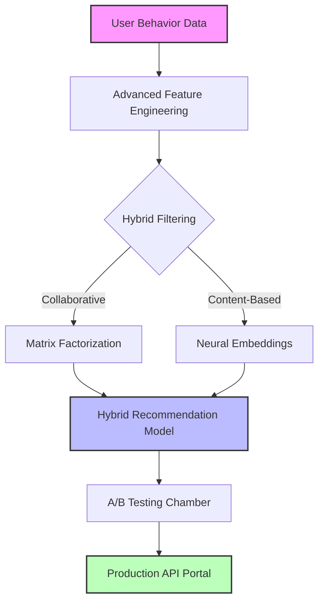
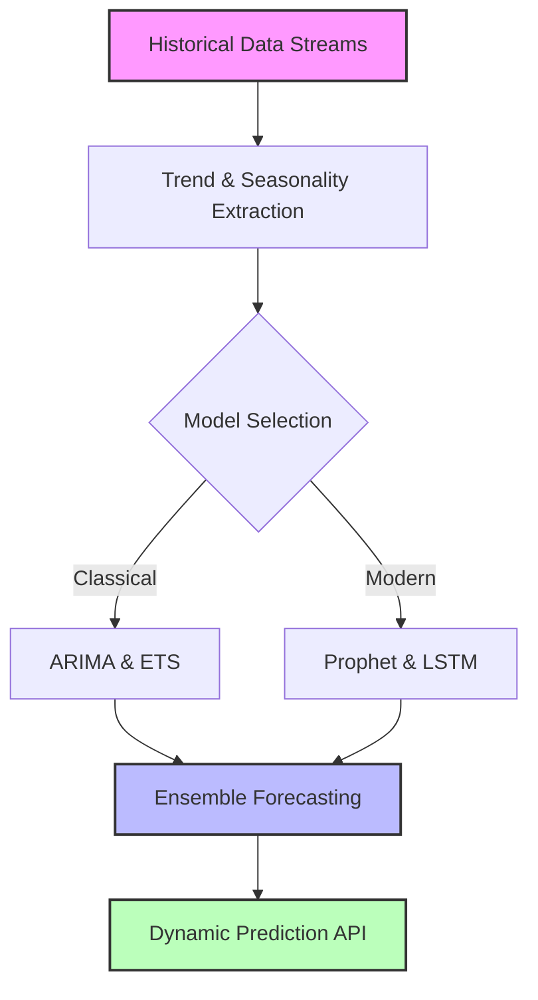

<div align="center">
  <pre style="line-height: 1.1;">
      ▄▄▄▄▄▄▄▄▄▄▄▄▄▄▄▄▄▄▄▄▄▄▄▄▄▄▄▄▄▄▄▄▄▄▄▄▄▄▄▄▄▄▄
      ███████████████████████████████████████████
      █░░░░░░░░░░░░░░░░░░░░░░░░░░░░░░░░░░░░░░░░░░█
      █░  WELCOME TO THE QUANTUM CODE ALCHEMY  ░█
      ███████████████████████████████████████████
  </pre>

  <div style="margin: 20px 0;">
    
    <b> + </b>
    
    <b> = </b>
    <span style="font-size: 2.5rem;">🔮</span>
  </div>

  <h1 style="margin: 0;">JOAQUIM TIMÓTEO</h1>
  <h3 style="font-style: italic; margin: 0;">Bilingual Data Architect | Python × R | Quantum Code Alchemist</h3>
  
  <div style="margin-top: 10px;">
    [](https://github.com/joaquimtimoteo)
    [](https://www.linkedin.com/in/joaquim-timóteo-619957227)
    [](https://kaggle.com/joaquimtimoteo)
  </div>
</div>

---

<div align="center">
  <h2>🔄 DUAL-WIELDING DATA SCIENCE & CODE ALCHEMY 🔄</h2>
  <i>Porque dominar duas linguagens é o primeiro passo para transcender os limites da análise de dados.</i>
</div>

```
╔══════════════════╗    ╔═══════════════════╗
║  PYTHON DOMAIN   ║    ║     R DOMAIN      ║
╚══════════════════╝    ╚═══════════════════╝
          ┃                       ┃
          ▼                       ▼
┏━━━━━━━━━━━━━━━━━━━━━━┓   ┏━━━━━━━━━━━━━━━━━━━━━━┓
┃ • TensorFlow         ┃   ┃ • Tidyverse          ┃
┃ • PyTorch            ┃   ┃ • Shiny              ┃
┃ • Scikit-learn       ┃   ┃ • Stan/brms          ┃
┃ • Dask & Spark       ┃   ┃ • data.table         ┃
┗━━━━━━━━━━━━━━━━━━━━━━┛   ┗━━━━━━━━━━━━━━━━━━━━━━┛
          ┃                       ┃
          ▼                       ▼
       ┏━━━━━━━━━━━━━━━━━━━━━━━━━━━━━━━━━━┓
       ┃      INTEGRATED DATA SOLUTIONS   ┃
       ┗━━━━━━━━━━━━━━━━━━━━━━━━━━━━━━━━━━┛
```

---

<div align="center">
  <h1>⚡ THE LANGUAGE TRANSFORMER: FROM CODE TO INSIGHT ⚡</h1>
</div>

---

## ✨ MY JOURNEY & PHILOSOPHY

> “Em um mundo de dados em constante evolução, a verdadeira magia reside na convergência entre a lógica do código e a criatividade humana.”  
> <span style="font-weight: bold;">– Joaquim Timóteo</span>

Minha trajetória começou na interseção entre algoritmos e arte, onde percebi que tanto Python quanto R são varinhas mágicas para transformar dados brutos em insights valiosos. Acredito que a integração desses universos permite a criação de soluções que não apenas resolvem problemas, mas inspiram inovações disruptivas.

---

## 🧪 CODE ALCHEMY LABORATORY

### Python Incantations: The ML Spellbook

```python
def summon_ml_powers():
    """
    Convoca os feitiços de Machine Learning para transformar dados em sabedoria.
    """
    spells = {
        "classification": [
            "🌲 RandomForest",
            "🔥 XGBoost",
            "🧠 Neural Networks"
        ],
        "regression": [
            "📉 LinearRegression",
            "💫 ElasticNet",
            "🌊 GradientBoosting"
        ],
        "clustering": [
            "🌀 K-Means",
            "📊 DBSCAN"
        ]
    }
    
    incantation = "✨ Machine Learning Wizardry Unleashed! ✨"
    return spells, incantation
```

### R Enchantments: The Statistical Grimoire

```r
cast_statistical_magic <- function() {
  # Lista de feitiços para modelagem e análise estatística
  spells <- list(
    modeling = c("📊 ggplot2", "🧮 lme4", "🔮 Stan"),
    analysis = c("📈 time series", "🌐 spatial", "🧩 structural"),
    visualization = c("📉 ggplot2", "✨ plotly")
  )
  
  incantation <- "✨ Statistical Sorcery Unleashed! ✨"
  return(list(spells = spells, incantation = incantation))
}
```

---

## 📈 PROJECT ALCHEMY: ARCHITECTING DATA REALMS

<div align="center">
  <h2>COMPLEX PROJECTS & DATA METAMORPHOSIS</h2>
</div>

### 🧠 Recommendation Engine of the Future



### ⏳ Time Series Forecasting Beyond Time



---

## 🧩 CROSS-PLATFORM SYNERGY

<table align="center" style="width:100%; text-align: center;">
  <tr>
    <td width="25%">
      <strong>Data Transformation</strong>
      <br>
      Python: `pd.melt()`, `pivot_table()`
      <br>
      R: `tidyr::pivot_longer()`, `spread()`
    </td>
    <td width="25%">
      <strong>Machine Learning</strong>
      <br>
      Python: `scikit-learn`, `TensorFlow`
      <br>
      R: `caret`, `mlr3`
    </td>
    <td width="25%">
      <strong>Deployment</strong>
      <br>
      Python: `Flask`, `FastAPI`
      <br>
      R: `plumber`, `shiny`
    </td>
    <td width="25%">
      <strong>Visualization</strong>
      <br>
      Python: `Plotly Dash`, `Seaborn`
      <br>
      R: `Shiny`, `ggplot2`
    </td>
  </tr>
</table>

---

## 🧪 CODE POTIONS: THE ART OF BREWING INSIGHTS

### ⚗️ PYTHON BREW: THE POTION OF PREDICTION

```python
from sklearn.pipeline import Pipeline
from sklearn.ensemble import RandomForestClassifier
from sklearn.preprocessing import StandardScaler, OneHotEncoder
from sklearn.compose import ColumnTransformer
from sklearn.impute import SimpleImputer

def craft_ml_potion(data, target, selector_num, selector_cat):
    """
    Transforma dados brutos em uma poção preditiva.
    """
    numeric_transformer = Pipeline(steps=[
        ('imputer', SimpleImputer(strategy='median')),
        ('scaler', StandardScaler())
    ])
    
    categorical_transformer = Pipeline(steps=[
        ('imputer', SimpleImputer(strategy='constant')),
        ('encoder', OneHotEncoder(handle_unknown='ignore'))
    ])
    
    preprocessor = ColumnTransformer(transformers=[
        ('num', numeric_transformer, selector_num),
        ('cat', categorical_transformer, selector_cat)
    ])
    
    model_pipeline = Pipeline(steps=[
        ('preprocessor', preprocessor),
        ('classifier', RandomForestClassifier(
            n_estimators=100,
            max_features='sqrt',
            bootstrap=True,
            oob_score=True
        ))
    ])
    
    model_pipeline.fit(data, target)
    return "✨ The predictive potion is complete! ✨"
```

### ⚗️ R ELIXIR: THE BREW OF STATISTICAL WONDERS

```r
library(tidyverse)
library(brms)

craft_statistical_elixir <- function(data, prediction_data) {
  formula <- bf(
    outcome ~ s(predictor1) + (1 + predictor2 | group)
  )
  
  elixir <- brm(
    formula = formula,
    data = data,
    family = gaussian(),
    prior = c(
      prior(normal(0, 5), class = "b"),
      prior(normal(0, 3), class = "sd")
    ),
    chains = 4,
    iter = 2000,
    warmup = 1000,
    cores = 4
  )
  
  predictions <- posterior_predict(elixir, newdata = prediction_data)
  return("✨ The statistical elixir has been brewed! ✨")
}
```

---

## 📚 SPELLBOOKS & KNOWLEDGE TOMES

<table align="center" style="width: 100%; text-align: center;">
  <tr>
    <td width="33%">
      <h3>🐍 Python Grimoire</h3>
      <ul style="text-align: left; display: inline-block;">
        <li>Deep Learning Incantations</li>
        <li>NLP Enchantments</li>
        <li>Computer Vision Spells</li>
        <li>MLOps Rituals</li>
        <li>Generative Adversarial Magics</li>
      </ul>
    </td>
    <td width="33%">
      <h3>📊 R Tome</h3>
      <ul style="text-align: left; display: inline-block;">
        <li>Bayesian Prophecies</li>
        <li>Statistical Divinations</li>
        <li>Time Series Scrying</li>
        <li>Visualization Conjuring</li>
        <li>Reproducible Research Rites</li>
      </ul>
    </td>
    <td width="33%">
      <h3>⚙️ Engineering Scrolls</h3>
      <ul style="text-align: left; display: inline-block;">
        <li>Cloud Architecture Runes</li>
        <li>API Integration Sigils</li>
        <li>Database Enchantments</li>
        <li>CI/CD Talismans</li>
        <li>Containerization Charms</li>
      </ul>
    </td>
  </tr>
</table>

---

<div align="center">
  <h2>🔮 THE PROPHECY OF INSIGHT 🔮</h2>
  <pre style="font-style: italic; max-width: 700px; margin: auto;">
No reino dos dados, um praticante bilíngue se ergue,
Onde Python e R se unem em uma convergência mística.
Junte-se a mim, destemidos alquimistas e magos do código,
Para transmutar dados brutos em riquezas decisórias.
  </pre>
  <br>
  <h3>🧙‍♂️ EMBARK ON THIS QUEST 🧙‍♀️</h3>
  [](https://github.com/joaquimtimoteo)
</div>

---

<div align="center">
  <pre style="line-height: 1.1;">
           ___                             ___           
          /\__\          ___              /\  \          
         /::|  |        /\  \            /::\  \         
        /:|:|  |        \:\  \          /:/\:\  \        
       /:/|:|__|__      /::\__\        /::\~\:\  \       
      /:/ |::::\__\  __/:/\/__/       /:/\:\ \:\__\      
      \/__/~~/:/  / /\/:/  /          \/__\:\ \/__/      
            /:/  /  \::/__/                \:\__\        
           /:/  /    \:\__\                 \/__/        
          /:/  /      \/__/                              
          \/__/                                          
  </pre>
</div>
