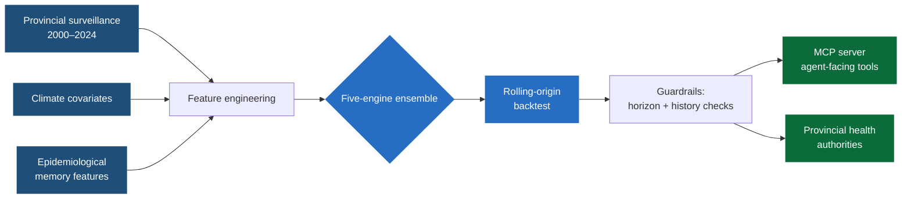

# Joaquim Timóteo

### AI Researcher · Senior Software Engineer · Generative AI & Agentic Systems

---

I build machine learning systems that reach production and stay there.

I'm an AI researcher at the **AIRI Institute** (Advanced Computing Research Laboratory, Moscow), where I built the first operational malaria early-warning system covering every province of Angola — a five-engine ensemble forecasting outbreaks **six to eight weeks ahead**. Behind the research sits seven years of production engineering: fintech platforms scaled past 5,000 active users, fraud-detection models running in live financial systems, and deep-learning training accelerated 3× with CUDA and TensorRT.

Nominated for **Forbes Africa Lusophone "Under 30"** · Invited speaker at **CPHIA 2026**, Addis Ababa

---

## Featured work

### 🦟 [malaria-forecast-mcp](https://github.com/joaquimtimoteo/MCP-server-Malaria) — MCP server for agentic epidemiological forecasting

An MCP server that gives AI agents access to provincial malaria surveillance and short-horizon outbreak forecasting — with the guardrails that make model output safe for an agent to act on.

| | |
|---|---|
| **Provenance as a protocol resource** | A machine-readable model card an agent can read *before* quoting a forecast — validation method, measured skill, known failure modes |
| **Structured refusals** | Ask for a 20-week horizon and it returns a typed error naming the validated range, not a plausible wrong number |
| **Empirical uncertainty** | Every point carries an 80% interval calibrated from rolling-origin residuals, not a distributional assumption |
| **Evaluation gates CI** | 468 scored forecasts per horizon; the build fails if the model stops beating the seasonal baseline |

The harness caught two defects I would not have found by inspection: ensemble weights that lost to a naive baseline at long horizons, and 80% intervals with 90–95% empirical coverage. Both are documented in the README rather than quietly fixed.

`Python` · `MCP SDK` · `CI across 3.10–3.12` · `MIT`

---

### 📈 Malaria Early-Warning System (Angola)

Operational forecasting across all 18 provinces under the administrative division in force during the study period (2000–2024), combining climate covariates with epidemiological-memory features.

| Metric | Value |
|:---|:---|
| R² | **0.985** |
| Mean absolute error | **6.9** cases per 1,000 |
| Skill score vs. seasonal baseline | **87.5%** |
| Forecast lead time | **6–8 weeks** |
| Coverage | **All provinces**, 2000–2024 |

K-means stratification resolved the provinces into three epidemiological strata and exposed a **2.8× burden disparity**, providing an evidence base for differentiated resource allocation. Featured by international media in four languages.

```mermaid
graph LR
    S[Provincial surveillance<br/>2000–2024] --> F[Feature engineering]
    C[Climate covariates] --> F
    M[Epidemiological<br/>memory features] --> F
    F --> E{Five-engine ensemble}
    E --> B[Rolling-origin<br/>backtest]
    B --> G[Guardrails:<br/>horizon + history checks]
    G --> A[MCP server<br/>agent-facing tools]
    G --> H[Provincial health<br/>authorities]

    classDef data fill:#1f4e79,color:#fff,stroke:none;
    classDef model fill:#276DC3,color:#fff,stroke:none;
    classDef out fill:#0b6b3a,color:#fff,stroke:none;
    class S,C,M data;
    class E,B model;
    class A,H out;
```

---

### 🔍 Cross-dataset evaluation of a mammographic lesion classifier

Measured internal performance against **external generalisation failure**, with Grad-CAM explainability to identify not just whether the model degraded but *where its attention shifted when it did*. Accuracy reported on internal validation is not evidence of clinical reliability elsewhere.

---

### Other projects

| Project | What it is |
|---|---|
| **xboot** | AI social-media automation bot — LSTM, CNN and BERT models across Instagram, Facebook and WhatsApp |
| **Reborn Bet** | Sports streaming and prediction platform combining data analysis and ML at 80% accuracy |

---

## Publications

- **Operational Malaria Forecasting in Angola Using Ensemble Models, Regional Clusters, and Epidemiological Memory Features** — *ResearchGate*, Feb 2026
- **A Hybrid Artificial Intelligence Framework for Extreme Pattern Discovery in Complex Systems** — *Article and Conference Paper*, Sep 2025
- **Internal Performance and External Generalization Failure of a Deep Learning Classifier for Mammographic Lesion Assessment: A Cross-Dataset Evaluation with Explainability Analysis** — *ResearchGate*, Aug 2026

---

## Recognition

- **Forbes Africa Lusophone "Under 30" Nominee (2026)** — for AI innovation with social impact
- **"Jovem da Diáspora que Honra Angola"** — national distinction for diaspora achievement
- **Letter of Recommendation, Artificial Intelligence Research Institute (AIRI)** — Apr 2026
- **Invited Speaker**, 5th International Conference on Public Health in Africa (CPHIA 2026), Addis Ababa
- **Speaker**, National Forum on Artificial Intelligence (FNIA), Angola

Work covered by Forbes África Lusófona, Sputnik Africa, Pulse of Africa, Jornal de Angola, SAPO, PTI and Izvestia.

---

## Stack

**Generative AI & agents**

**ML & research**

**Backend & data**

**Cloud & DevOps**

**Security** — BSc Information Security & Cybersecurity (in progress) · PWST (TCM Security) · PCI DSS (TÜV SÜD) · IAM/MFA in production

---

## What I'm working on

Turning the Claude ecosystem work into shipped code rather than certificates: an MCP server plus a RAG pipeline with an evaluation harness, in the epidemiological forecasting domain I know best. If a system is going to be consulted by an agent instead of a specialist, the guardrails have to travel with it.

---

**Portuguese** (native) · **English** (C2) · **Russian** (C1) · **French** (B1)

Remote delivery across Angola, Brazil, Saudi Arabia and Russia.

📫 **joaquimcarltimoteo@gmail.com**

